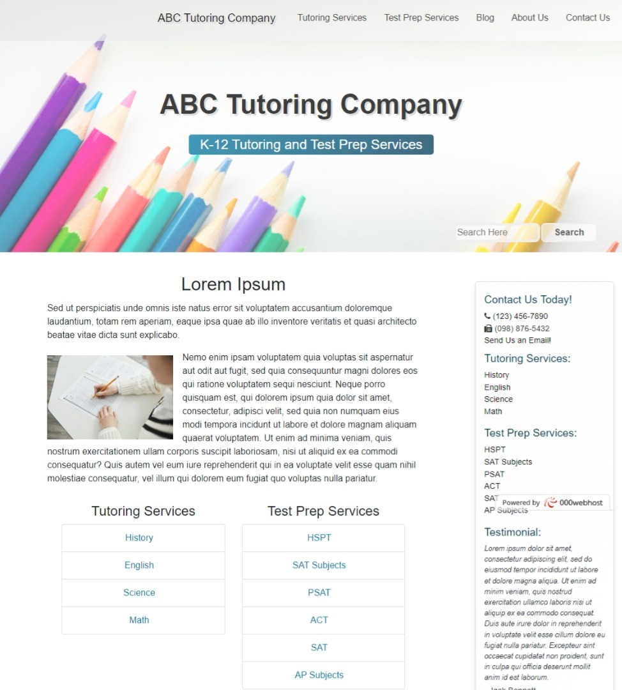
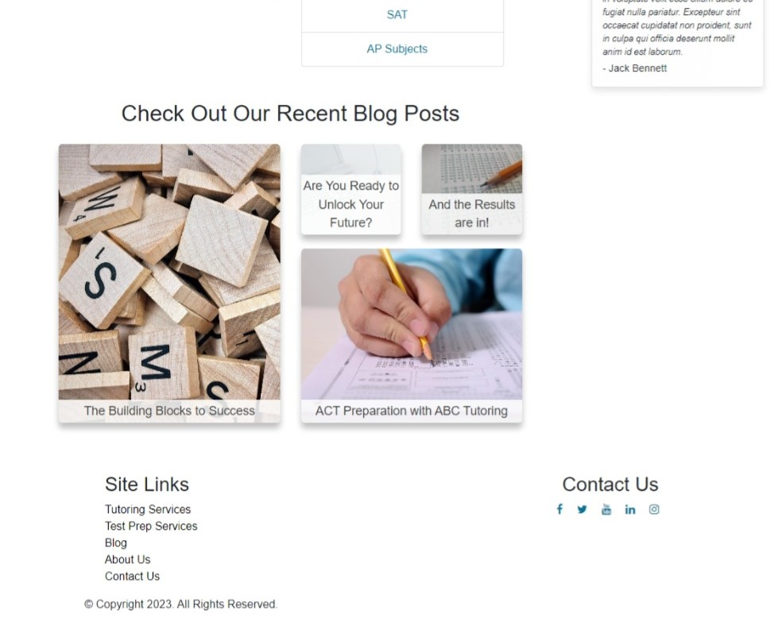
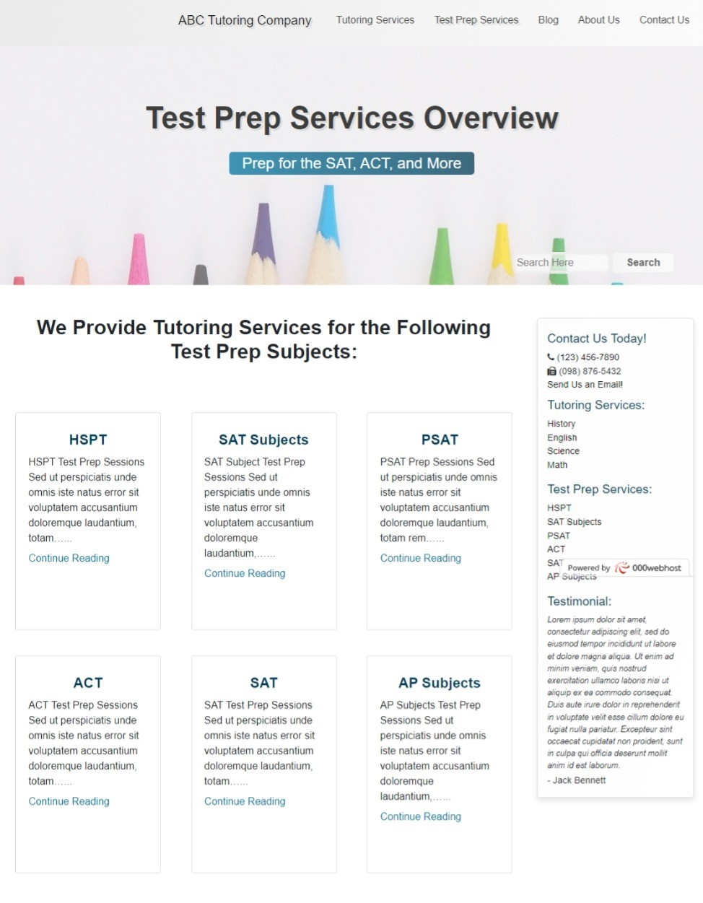
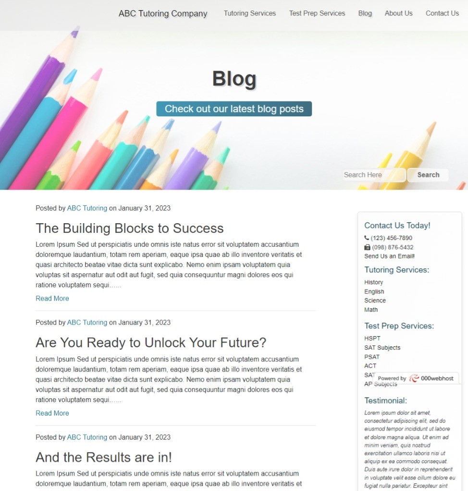
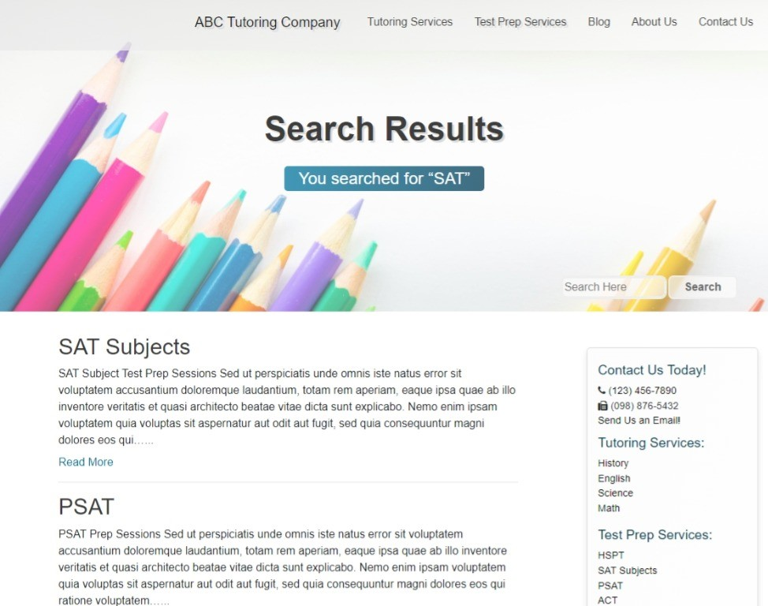
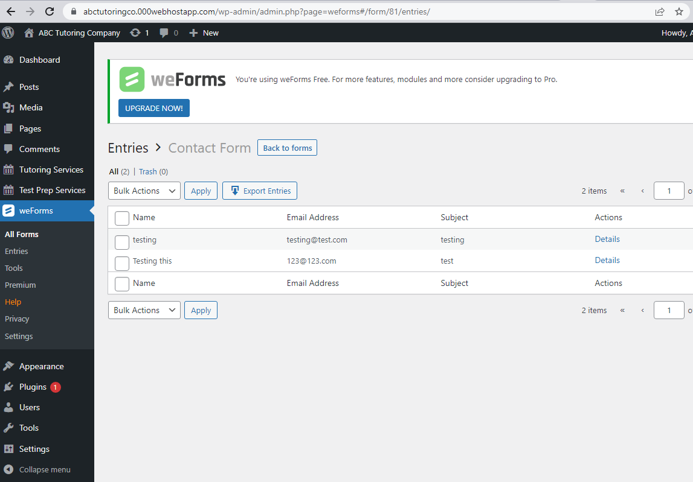

# ABC Tutoring Company Website

A simple custom WordPress theme for the ABC Tutoring Company. Built with PHP, WordPress, Bootstrap, and CSS. The weForms plugin was used for the form on the Contact Us page.

## Project Screen Shot(s)

Home Page Jumbotron, Navbar, and Search Field

The home page features a navbar, jumbotron, and search field.

Blog Post Photo and Title Grid

The bottom of the home page features a blog post photo and title grid which changes based on screen size to remain responsive.

Tutoring and Test Prep Services Overview Pages

The Test Prep Services and Tutoring Services pages include bootstrap cards, which draw data from the two custom post types created for the website.

Blog Page

The blog page utilizes the built-in post type. It includes the author name and publication date for each post. The author name can be clicked on to access an archive of all blog posts from that author.

Search Results Page

After entering a search term in the input box in the jumbotron and clicking search, results will display from a custom WordPress query. The results include all post types.

Contact Us Page Form

The form in the Contact Us page was created with the weForms plugin. Form entries can be found in the wp-admin panel for weForms.

## See Live

Visit: https://abctutoringco.000webhostapp.com/

## Reflection

I built this project while studying WordPress to familiarize myself with how to build WordPress websites. Creating two custom post types and a custom WordPress search query helped me explore some of the features WordPress has to offer.

## References

- Udemy - Brad Schiff - Become a WordPress Developer: Unlocking Power With Code - https://www.udemy.com/course/become-a-wordpress-developer-php-javascript/ (For guidance on how to set up WordPress websites. Also, some of the functions found in functions.php were adapted from this course.)

Stock Photos:
- https://www.pexels.com/photo/person-holding-a-chalk-in-front-of-the-chalk-board-714699/
- https://www.pexels.com/photo/text-on-shelf-256417/
- https://www.pexels.com/photo/white-tablet-and-computer-set-of-a-desk-5185159/
- https://www.pexels.com/photo/alphabet-close-up-communication-conceptual-278887/
- https://www.pexels.com/photo/person-writing-on-white-board-3781338/
- https://www.pexels.com/photo/close-up-photography-of-colored-pencils-743986/
- https://www.pexels.com/photo/colored-pencils-on-a-white-surface-4519868/
- https://www.pexels.com/photo/a-person-writing-on-white-paper-using-pencil-6684265/
- https://www.pexels.com/photo/a-person-taking-an-exam-6684209/
- https://www.pexels.com/photo/colored-pencils-3977580/
- https://www.pexels.com/photo/grey-concrete-3-baluster-near-mountains-and-sea-during-daytime-164268/
- https://pixabay.com/photos/boy-man-people-person-male-adult-3653385/
- https://www.pexels.com/photo/pile-of-books-159866/
- https://pixabay.com/photos/test-testing-exam-sat-act-mcat-986769/
